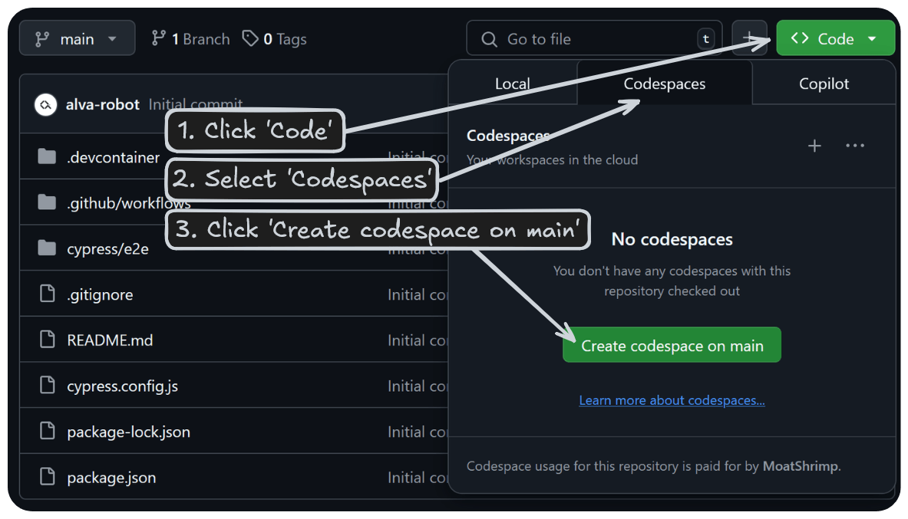

# SALT's JavaScript Code test

Welcome! We're excited that you're interested in applying for SALT's JavaScript and TypeScript course!
Below are the instructions for this short coding test. Please read them carefully to avoid any issues.

This code test should give you a taste of how it is to work as a software developer! It might ask you to do things you are unfamiliar with but don't worry, that's real life everyday as a dev! Just do your best!

Good luck!

## Time estimate

Between 10 minutes and 45 minutes depending on how used you are to coding, plus the time to set up the codebase.

## Mandatory steps before you get started

1. **Set Up Your Coding Environment**

   You have two options:

   - **Recommended:** Start a GitHub Codespace session. This will create a coding environment in which you can finish the test.  
     
   - **Alternatively:** Clone this repository if you're comfortable using Git, GitHub and Node. If you choose this option, ensure you have Node v22 installed locally.

2. **Know How to Get Help**

   If you run into any issues, [check this guide for support](https://help.alvalabs.io/en/articles/9028899-how-to-ask-for-help-with-coding-tests).

## The task

<!--TASK_INSTRUCTIONS_START-->

### Info

- All code should be written in the [./main.js](./main.js) file and inside the Main class. **Do not modify the other files.**
- You will need to use [the terminal](https://www.w3schools.com/whatis/whatis_cli.asp) to run commands.
- **After each step, we want you to do a [git commit](https://github.com/git-guides/git-commit)** to create a snapshot of your code
- To submit your work, you till have to **push your code** to GitHub using [git push](https://github.com/git-guides/git-push), even if you are using GitHub Codespaces.

#### Git - a quick primer

Git is version control tool used for taking snapshots of code at a specific moment in time. It's used by virtually all professional programmers today and learning how to use it is incredibly valuable. For this code test however, you only need to run a few commands.

1.  ```shell
    # to create a snapshot of your code with a specific message, replace '<your-message-here>' with your own message
    git add -A && git commit -m '<your-message-here>'
    ```
2.  ```shell
    # to send your code to GitHub
    git push origin main
    ```

Don't worry too much if you are not familiar with Git but it's important that you run the first command after each completed step!

#### Testing

- You can run the tests provided using the command `npm test` in the terminal. This will show you which tests you have completed.

### Instructions

<!--TASK_INSTRUCTIONS_START-->

<!--TASK_INSTRUCTIONS_END-->

### Solution expectations

- Follow the instructions and do your best to make the [provided tests](./main.js) pass.

## When you are done

1. Create a [Pull-Request](./../../compare/submission...main?quick_pull=1&title=Code+Submission&body=Create+a+pull+request+and+then+%5Bsubmit+your+results+over+at+alva+labs%5D%28https%3A%2F%2Fapp.alvalabs.io%2Fstart%2Fapply%2F298) using this link and clicking the green "Create pull request" button.

> [!WARNING]
> **Do NOT merge your pull request.**

2. Go to your application in [Alva Labs](https://app.alvalabs.io/start/apply/298) and submit your test.
